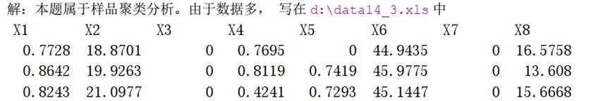

# SAS笔记

数据步一般输入数据不需要output，循环输入数据时一定要output，否则循环过程中会覆盖临时内存

过程步里，=不是“赋值为”的意思，而是“依赖于”的意思，=左边是因变量，右边是自变量

means group / hovtest; 中，/的功能是把“对象”和“选项”隔开：  
斜杠左边（group）：告诉 SAS，你要对哪个变量做均值比较？——对象是 group。  
斜杠右边（hovtest）：告诉 SAS，在做均值比较的同时，额外附加一个什么要求？——附加要求是“顺便帮我做一下方差齐性检验（HOVTEST）”。

‍

## <span id="20260704144535-moakw58" style="display: none;"></span>描述性统计

```sas
libname saslib base 'c:\sas\data'; /* 定义逻辑库，路径为 c:\sas\data */
proc import out=saslib.ex1 /* 导入 Excel，输出数据集 saslib.ex1 */
datafile="c:\sas\data\ex1.xlsx" /* 指定 Excel 文件路径 */
dbms=xlsx replace; /* 用 xlsx 引擎，覆盖已存在数据集 */
range='pag$A1:C61'n; /* 读取工作表 pag 的 A1:C61 区域 */
run;
proc print data=saslib.ex1 noobs; /* 打印数据集，不显示行号 */
run;
proc univariate data=saslib.ex1 plot; /* 单变量描述统计，输出图形 */
title "Descriptive Statistics Using ProcUnivariate"; /* 标题 */
var height; /* 分析变量 height */
histogram / normal (mu=est sigma=est) kernel; /* 直方图叠加正态拟合（均值和标准差由数据估计）和核密度曲线 */
inset skewness kurtosis / position=ne; /* 在右上角插入偏度和峰度 */
run;
```

‍

## <span id="20260704151357-bj8gr54" style="display: none;"></span>区间估计和假设检验（练习2）

#### 第一题：保留两位小数，显著性取0.2，样本量、均值、标准差、标准误、均值置信区间上下限

```sas
proc means data=saslib.ex1 maxdec=2 alpha=0.1 n mean std stderr clm;
   var height;
run;
```

‍

#### 成对比较检验（第二题）

```sas
data ex10_3;
input x1 x2 @@;
diff=x1-x2;
datalines;
37.2 25.7
20.9 25.1
31.4 18.8
41.4 33.5
39.8 34.0
39.3 28.3
36.1 26.2
31.9 18.3
;
proc univariate normal;
var diff;
run;
```

‍

#### 非成对两总体均值检验

```sas
data eg4;
  input f g$ @@;
  cards;
92 1 78 1 94 1 88 1 76 1 87 1 69 2 52 2 86 2 80 2 47 2 63 2 76 2 82 2
;
run;

proc ttest data=eg4;
  class g;
  var f;
run;
```

‍

## <span id="20260704154958-2urdzi2" style="display: none;"></span>方差分析和实验设计（练习3）

原假设是分组变量对均值无影响，备择假设是有影响，当p小于阈值时认为目标量是依赖于分组变量的

#### 第二题（注意前提！！！）

```sas
filename extfile 'd:\wine.txt'; /* 定义外部文件引用 */
data wine; /* 创建数据集 wine */
infile extfile delimiter='09'x firstobs=2; /* 读取制表符分隔文件，从第2行开始（跳过表头） */
input group wine @@; /* 读取组别和酒样编号，行停留继续读本行后续数据 */
do i=1 to 10; /* 循环10次，读取10个评委的分数 */
input score @@; /* 读取一个分数，行停留继续读下一个 */
output; /* 每读一个分数立即输出一条观测 */
end;
run;
proc glm data=wine; /* 广义线性模型，指定数据集 */
class group wine; /* 声明分类变量：组别和酒样 */
model score=group wine group*wine; /* 模型：评分由组别、酒样及其交互效应解释 */
means group/hovtest; /* 输出组别均值，并对方差齐性做检验（斜杠为选项分隔符） */
run;
quit; /* 退出GLM过程 */
```

#### 第一题

```sas
data eg1;
input a b y;
cards;
1 1 71
1 1 73
1 2 72
1 2 73
1 3 75
1 3 73
1 4 77
1 4 75
2 1 73
2 1 75
2 2 76
2 2 74
2 3 78
2 3 77
2 4 74
2 4 74
3 1 76
3 1 73
3 2 79
3 2 77
3 3 74
3 3 75
3 4 74
3 3 73
4 1 75
4 1 73
4 2 73
4 2 72
4 3 70
4 3 71
4 4 69
4 4 69
;
proc print;
run;
proc anova;
class a b;
model y=a b a*b;
run;

```

同一道题还可以（非均衡和均衡数据都可以，数据步一致）：

```sas
proc print;
run;
proc glm;
class a b;
model y=a b a*b;
lsmeans a*b/pdiff;
run;

```

‍

‍

## <span id="20260704093459-b4v1trb" style="display: none;"></span>回归分析（练习4）

#### 第四题（完整代码请看文件）

**相关性分析、一元线性回归、多元回归、logistic全变量回归、逐步logistic回归、预测概率**

（1）假定不考虑药物种类、性别、年龄的影响，仅考察 CD34+与 MNC 之间的相互关系和依赖关系（其中

MNC 是不便观测的定量指标），请选择合适的统计分析方法去处理资料。

（2）研究者希望根据此类疾病患者的“药物种类、性别、年龄、体重、CD34+”的信息，去预测 MNC 的

数值大小，请选择合适的统计分析方法处理资料。

（3）研究者希望将 MNC 分为 4.50 以上与 4.50 以下两档（设 Y\=1 代表 MNC4.50、Y\=0 代表 MNC\<4.5），

并希望根据此类疾病患者的“药物种类、性别、年龄、体重、CD34+”的信息，去预测 MNC 取值大

于等于 4.5 的概率大小，请选择合适的统计分析方法处理资料。

### 线性回归

#### 第一题

**求回归方程并作预测**

```sas
data ex16_1;                                 /* 创建数据集 ex16_1 */
input X Y @@;                                /* 输入变量 X 和 Y，@@ 使指针在同一行连续读取多对数据，不换行 */
datalines;                                   /* 开始输入原始数据 */
0.2 7.6 0.4 12.3 0.6 15.7 0.8 18.2 1.0 18.7 /* 数据行：X与Y成对出现 */
1.2 21.4 1.4 22.6 1.6 23.8 1.7 .. 1.8 .. 1.9 .. 2.0 .. /* 后续数据，其中 .. 表示对应Y值为缺失值（SAS将自动忽略含缺失Y的观测） */
;                                            /* 数据行结束 */
run;                                         /* 数据步结束并执行 */
proc reg;                                    /* 调用回归过程（PROC REG）进行普通最小二乘线性回归 */
model Y=X/cli p;                             /* 定义回归模型：Y 对 X 作线性回归；/ 后 cli 输出单个Y的预测区间，p 输出预测值和残差 */
run;                                         /* 执行回归分析 */
quit;                                        /* 退出 PROC REG 的交互式运行状态 */
```

> [!NOTE]
> 结果分析：
>
> 浓度与峰高的回归曲线方程为 Y\=7.76071+10.86310X。
>
> X\=1.7 时，Y 的预测值为 26.2280, 95%置信区间[21.8306, 30.6253];
>
> X\=1.8 时，Y 的预测值为 27.3143, 95%置信区间[22.7716, 31.8570];
>
> X\=1.9 时，Y 的预测值为 28.4006, 95%置信区间[23.7008, 33.1004];
>
> X\=2.0 时，Y 的预测值为 29.4869, 95%置信区间[24.6193, 34.3545].

#### 第二题

**多元线性回归模型、显著性分析**

```sas
data ex16_2;/* 创建数据集 ex16_2 */
input y x1 x2;/* 定义因变量 y 和自变量 x1、x2（每行读取一个观测的3个数值） */
datalines;/* 开始输入原始数据（每行一个样本的 y, x1, x2） */
12.21 152 9.51 
14.54 167 11.43
12.27 119 7.53
12.04 140 12.17
7.88 198 2.33
11.10 162 13.52
10.43 170 10.07
13.32 103 18.89
19.59 59 13.14
9.05 187 96.3
6.44 251 5.10
9.49 164 4.53
10.16 220 2.16
8.38 231 4.26
8.49 232 3.42
7.71 250 7.34
11.38 168 12.25
10.82 112 10.88
12.49 137 11.06
9.21 244 9.16
;                                            /* 数据行结束 */
run;                                         /* 数据步结束并执行 */
proc reg;                                    /* 调用回归过程（PROC REG）进行多元线性回归 */
 model y=x1 x2/ss2;/* 定义回归模型：y 对 x1 和 x2 线性回归；/ 后 ss2 输出各自变量的II型平方和（控制其他变量后的独有贡献） */
run;                                         /* 执行回归分析 */
quit;                                        /* 退出 PROC REG 的交互式运行状态 */
```

注：II型平方和（控制其他变量后的独有贡献）其实是用来构建偏相关系数的“偏协方差”

> [!NOTE]
> 结果分析：
>
> 由方差分析表 p 值\<0.0001 知模型显著，R2 值约 71%。 由 t 检验的 p 值和 Type II SS 知 x1 显著。
>
> 回归方程为 y\=19.00019–0.04620\*x1-0.01085\*x2。
>
> 也可用逐步回归 stepwise,得模型 18.79614-0.04585x1.

### logistic回归

#### 第三题

**计算频数表、logistic回归、逐步回归筛选自变量、预测概率**

文件 build.txt 为一批信用卡使用记录，四列数据依次为 credit\_limit(客户持有其他信用卡的平均信用上

限)、number\_of\_trades(交易次数)、utilization(使用率)、Target(客户类型，O 代表流通帐户，A 代表注

销账户)。

(1) 使用 proc import 将文本数据导入 SAS, 生成永久 sas 数据集 build;

(2) 使用 proc freq 计算客户类型的频数表；

(3) 使用 proc logistic 建立回归模型建立客户类型与其他变量的回归关系，注意应使用逐步回归筛选自变

量；

(4) 根据回归模型预测该账户继续流通的概率。

```sas
‍libname study "d:\";                                                      /* 定义逻辑库 study，指向 d 盘根目录 */
proc import out=study.ex16_4 datafile="d:\build.txt" replace;            /* 导入 d:\build.txt 文本文件，生成 study.ex16_4 数据集，若存在则覆盖 */
getnames=yes;                                                             /* 指定 txt 文件的第一行作为变量名 */
datarow=2;                                                                /* 指定从第 2 行开始读取数据（跳过表头行） */
run;                                                                      /* 导入过程结束 */
proc freq;                                                                /* 调用 FREQ 过程进行频数统计（默认使用最近创建的 study.ex16_4 数据集） */
tables Target;                                                            /* 对目标变量 Target 做频数分布表，查看类别分布（如好坏客户比例） */
run;                                                                      /* 频数过程结束 */
proc logistic;                                                            /* 调用 LOGISTIC 过程进行二项逻辑回归分析（默认使用 study.ex16_4） */
model Target=credit_limit number_of_trades utilization/selection=stepwise; /* 定义逻辑回归模型，因变量 Target，自变量为信用额度、交易笔数和利用率，采用逐步回归法筛选显著变量 */
output out=pred p=phat lower=lcl upper=ucl;                               /* 输出预测结果到 pred 数据集：p=phat 为预测概率，lower/upper 为预测概率的 95% 置信区间上下限 */
run;                                                                      /* 逻辑回归过程结束 */
proc print data=pred;                                                     /* 打印输出数据集 pred，查看各观测的预测概率及置信区间 */
run;                                                                      /* 打印结束 */
```

> [!NOTE]
> 结果分析：
>
> 频数表中注销客户 15 个，占 26.32%， 流通客户 42 个，占 73.68%.
>
> Logistic 回归模型为
>
> Log(p/(1-p))\= -6.6245+0.00188\*credit\_limit
>
> 这里 p 是注销账户的概率（Probability modeled is Target\='A'）。 模型说明账户是否继续流通不受
>
> number\_of\_trades(交易次数)和 utilization(使用率)影响，而 credit\_limit(客户持有其他信用卡的平均信用上限)
>
> 大的客户注销账户的概率较大。
>
> 优比 odds ratio p/(1-p)\=exp(0.00188)\=1.002
>
> 预测概率与观测因变量的关联性中一致性比率 percent concordant 91.6%, 不一致比率 7.8%. 说明预测值与
>
> 观测值在现有水平上有很强关联性， 回归模型预测能力强。
>
> 预测结果：
>
> 第 1 个账户现为流通账户，注销概率 0.01515, 继续流通概率 1-0.01515\=0.98485
>
> 第 2 个账户现为流通账户，注销概率 0.12866, 继续流通概率 1-0.12866\=0.87134
>
> 第 3 个账户现为注销账户，注销概率 0.84131, 继续流通概率 1-0.84131\=0.15869
>
> …..
>
> 注：手工计算注销概率的方法（以第 1 个账户现为例）
>
> Log(p/(1-p))\=-6.6245+0.00188\*1300\=-4.1805
>
> p/(1-p)\=exp(-4.1805)
>
> p\=0.01515

‍

## 主成分分析（练习5）

```sas
data ex12_3;
    infile "d:\data12_3.txt" delimiter=";";
    input Num Pop Edu Load Science GDP Room;
run;

proc princomp data=ex12_3 out=out1; /*主成份分析*/
    var Pop Edu Load Science GDP Room;

proc sort data=out1; /*按第一主成分排序*/
    by prin1;

proc print data=out1; /*输出结果*/
    id Num;
    var prin1 Pop Edu Load Science GDP Room;
run;
```

‍

## <span id="20260704093500-mp773jf" style="display: none;"></span>因子分析（练习5）

主成分法  
可能还需要`proc score`来算因子得分，会需要对因子得分进行排列

```sas
data ex12_4;                                 /* 创建数据集 ex12_4 */
infile "d:\data12_4.txt" firstobs=2 delimiter='09'x dsd; /* 读取txt文件，从第2行开始，以制表符为分隔，连续制表符视为缺失 */
input STATE $ MURDER RAPE ROBBERY ASSAULT BURGLARY LARCENY AUTO ; /* 定义变量：州名（字符）和7种犯罪率 */
run;                                         /* 数据步结束 */
proc factor data=ex12_4 simple corr rotate=varimax preplot plot ; /* 因子分析：输出描述统计、相关系数、正交旋转、旋转前后载荷图 */
run;                                         /* 执行因子分析 */
```

‍

## <span id="20260704094104-6vc3o6g" style="display: none;"></span>聚类分析（练习6）

### kmeans

**作K-Means聚类分析**

```sas
data ex12_4;                                 /* 创建数据集 ex12_4 */
infile "d:\data12_4.txt" firstobs=2 delimiter='09'x dsd; /* 读取制表符文件，从第2行开始，连续制表符视为缺失 */
input STATE $ MURDER RAPE ROBBERY ASSAULT BURGLARY LARCENY AUTO ; /* 输入州名（字符型）和7个犯罪率变量 */
run ;                                       /* 数据步结束 */
proc standard mean=0 std=1 out=stan;         /* 标准化处理：将各变量转换为均值为0、标准差为1的Z分数，输出到数据集stan */
    var MURDER RAPE ROBBERY ASSAULT BURGLARY LARCENY AUTO ; /* 指定需要进行标准化的变量 */
run;                                         /* 标准化过程结束 */
proc fastclus data=stan maxc=4 out=clus;     /* 快速聚类分析（K-means），指定最大聚类数为4，输出聚类结果到clus数据集，可选随机种子复现结果 */
    var MURDER RAPE ROBBERY ASSAULT BURGLARY LARCENY AUTO ; /* 指定聚类所使用的变量 */
run;                                         /* 聚类过程结束 */
proc print data=clus;                        /* 打印聚类结果数据集 */
    var state cluster;                       /* 仅输出州名和所属类别号 */
run;                                         /* 打印结束 */
```

‍

### 系统聚类/树聚类

**做聚类分析**



```sas
proc import datafile="d:\data14_3.xls" out=ex14_3 dbms=xls replace; /* 导入Excel文件，生成数据集ex14_3，覆盖重名文件 */
getnames=yes;                                                         /* 指定Excel第一行作为变量名 */
run;                                                                  /* 导入过程结束 */
proc print data=ex14_3;                                               /* 打印数据集，预览导入的数据 */
run;                                                                  /* 打印结束 */
PROC CLUSTER DATA=ex14_3 method=average OUT=TREE ccc pseudo;          /* 系统聚类分析：类平均法，输出树状数据，并输出CCC及伪F/伪t2辅助判断类数 */
run;                                                                  /* 聚类过程结束 */
PROC TREE DATA=TREE ncl=6 OUT=OUT;                                    /* 根据树状结构指定聚成6类，将分类结果输出到数据集OUT */
run;                                                                  /* TREE过程结束 */
proc print data=out;                                                  /* 打印聚类结果数据集 */
run;                                                                  /* 打印结束 */
quit;                                                                 /* 退出交互式过程步（或提交结束） */
```

‍

## <span id="20260704094805-wchhoc9" style="display: none;"></span>判别分析（练习6）

#### 练习6 第二题

```sas
DATA EX14_2;                                 /* 创建数据集 EX14_2 */
DO group=1 TO 2;                             /* 循环2次，生成分组变量 group=1,2 */
    INPUT x1-x3 @@;                          /* 读取一行中的3个数值，行停留继续读下一行（如果有） */
    OUTPUT;                                  /* 立即输出当前观测（每次循环输出一条） */
END;                                         /* 循环结束 */
DATALINES;                                   /* 开始输入原始数据 */
27.5 78.5 381.5 35.5 119.5 530.5
27.5 78.5 371.5 36.3 120.5 540.5
27.5 80.5 381.5 38.5 127.5 541.5
29.5 80.5 381.5 37.4 126.5 541.2
28.5 79.5 401.5 36.3 120.5 540.8
28.5 80.5 405.2 35.4 118.5 530.5
30.5 88.5 412.5 34.5 110.5 522.5
31.5 87.5 442.5 36.5 123.5 530.5
30.5 87.5 422.5 34.2 109.2 503.5
30.1 88.5 415.2 34.6 108.5 513.2
31.2 91.5 433.5 33.5 105.3 510.8
30.4 80.5 405.5 34.5 115.2 520.5
30.5 91.5 415.5 35.5 120.5 530.5
30.6 87.5 405.4 35.0 118.2 525.2
30.9 83.5 420.5 35.0 118.0 530.3
31.1 88.5 430.5 35.3 118.2 528.0
31.6 91.5 445.2 35.2 117.5 524.2
31.8 90.5 452.5 34.5 116.5 523.5
;                                            /* 数据行结束 */
run;                                         /* 数据步结束，执行 */
proc print;                                  /* 打印数据集 EX14_2 的所有观测 */
run;                                         /* 打印结束 */
proc discrim data=EX14_2 listerr;            /* 执行判别分析（线性判别），指定训练数据集，并输出分类结果及回代错误率 */
    class group;                             /* 指定分类变量为 group */
    var x1-x3;                               /* 指定判别变量为 x1, x2, x3 */
run;                                         /* 判别过程结束 */
data new;                                    /* 创建新数据集 new，用于存放待预测样本 */
    input x1-x3;                             /* 定义三个数值变量 */
cards;                                       /* 开始输入数据 */
30.5 110.2 510.8                            /* 新样本的 x1,x2,x3 值 */
;                                            /* 数据行结束 */
run;                                         /* 数据步结束 */
proc discrim data=ex14_2 testdata=new testout=plotp; /* 再次执行判别分析：训练集为 ex14_2，测试集为 new，将测试样本的判别结果输出到数据集 plotp */
    class group;                             /* 分类变量为 group */
    var x1-x3;                               /* 判别变量 */
run;                                         /* 判别过程结束 */
proc print data=plotp;                       /* 打印测试样本的判别结果（包括后验概率、预测分类等） */
run;                                         /* 打印结束 */
```

#### 练习6 第四题

```sas
proc discrim data=compny listerr;            /* 判别分析：使用compny数据集作为训练集，输出回代分类结果及错误率 */
class g;                                     /* 指定分类变量为g（1=破产，2=非破产） */
var x1-x4;                                   /* 指定判别变量为现金流量/总债务、净收入/总资产、流动比率、流动资产/净销售额 */
run;                                         /* 判别过程结束（第一次，仅训练集回代检验） */
data new;                                    /* 创建新数据集new，存放待判别的样本 */
input x1-x4;                                 /* 定义4个数值变量 */
cards;                                       /* 输入数据行 */
-0.16 -0.1 1.45 0.51                        /* 第47组公司的财务指标数据 */
;                                            /* 数据行结束 */
run;                                         /* 数据步结束 */
proc discrim data=compny testdata=new testout=out; /* 判别分析：训练集为compny，测试集为new，将测试样本的判别结果输出到out数据集 */
class g;                                     /* 分类变量为g */
var x1-x4;                                   /* 判别变量 */
run;                                         /* 判别过程结束（第二次，对新样本预测） */
proc print data=out;                         /* 打印测试样本的判别结果（包括后验概率、预测分类等） */
run;                                         /* 打印结束 */
```

‍

## <span id="20260704162551-razetde" style="display: none;"></span>交叉列连、关联分析（练习9）

**下面是一个医学例子，研究某类肺炎患者和以前是否曾经患过该类肺炎之间的疾病继承性关系。下面是 30 个人按照当前患某类肺炎和曾经患某类肺炎之间的 2×2 分类表。**

||以前有过某类肺炎|以前没有某类肺炎|总和|
| --| ------------------| ------------------| ------|
|**以前有过某类肺炎**|6|4|10|
|**以前没有某类肺炎**|1|19|20|
|**总和**|7|23|30|

```sas
data ex8;
input a b n;
cards;
1 1 6
1 2 4
2 1 1
2 2 19
;
run;
proc freq;
tables a*b/chisq;
weight n;
run;

```
