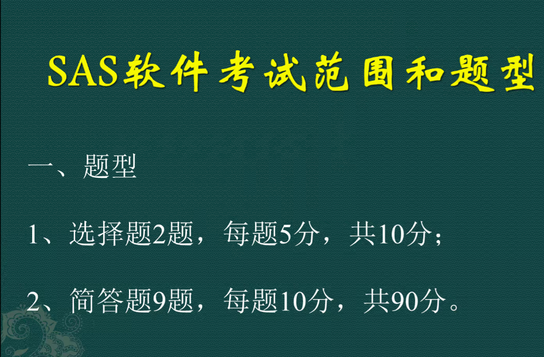
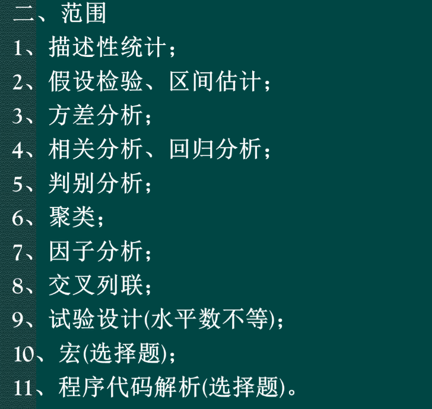

# 重点

宏考察程序输出什么

简答题：

1. 描述性统计，四分位数、均值、标准差、分布的判别（univariate）[描述性统计](../SAS笔记.md#20260704144535-moakw58)
2. 假设检验、区间估计（[区间估计和假设检验（练习2）](../SAS笔记.md#20260704151357-bj8gr54)）
3. 方差分析：只要看交互因素是否显著 [方差分析和实验设计（练习3）](../SAS笔记.md#20260704154958-2urdzi2)
4. 相关分析、回归分析  [回归分析（练习4）](../SAS笔记.md#20260704093459-b4v1trb)
5. 判别分析：判定未标注数据是什么   [判别分析（练习6）](../SAS笔记.md#20260704094805-wchhoc9)
6. 聚类，系统聚类画图，[聚类分析（练习6）](../SAS笔记.md#20260704094104-6vc3o6g)
7. [因子分析：主成分法+因子旋转](../SAS笔记.md#20260704093500-mp773jf)
8. 交叉列联表（送分，参考ppt）  [交叉列连、关联分析（练习9）](../SAS笔记.md#20260704162551-razetde)
9. 实验设计会给表

数据和卷子，超星复制代码和运行结果截图，卷子上要写过程步

