# 均值趋近正态分布的分析

## 数学基础

$X_i \stackrel{iid}{\sim} f_1$，$f_1$为p.d.f，$F_1$为分布函数

$S_n = \sum_{i=1}^n X_i$ 分布为 $f_n$，$S_{n-1}$与$X_n$的联合分布为 $f_{n-1}(s)f_1(x)$

$$
\begin{align}
	S_{n}\sim f_{n}(x) & = \int f_{n-1}(s)f_{1}(x-s)ds                              \\
	                   & = \int f_{n-1}(x-s)f_{1}(s)ds = \int f_{n-1}(x-s)dF_{1}(s)
\end{align}
$$

给定$\mathbb{E}X=0,Var(X)=1$的分布函数$f_1$（示例为均匀分布），由中心极限定理

$$
\frac{\bar{X}_{n}}{1/\sqrt{n}}=\frac{S_{n}}{\sqrt{n}}\xrightarrow{d}N(0,1)
$$

经变量替换$z=\frac{x}{\sqrt{n}}$，记$\frac{S_{n}}{\sqrt{n}}\sim p_{n}(z)=\sqrt{n}f_{n}(\sqrt{n}z)$，标准正态分布的概率密度函数设为$\varphi (x)$均值分布与正态分布之间的差距可以用以下$L^1$积分作为指标衡量：

$$
\delta_{n}=\int\limits_{}^{}|p_{n}(x)-\varphi(x) | dx
$$

若$\delta_{n} \rightarrow0$，则$p_n$几乎处处收敛于$\varphi$，即依分布收敛。

‍

## 代码逻辑

由于正态分布的“3sigma原则”，概率密度主要分布在$\left(-3，3 \right)$之间，所以我们只观察$\left(-4，4 \right)$，就能涵盖大部分概率。

#### 离散求解卷积

取步长$\Delta x \in \mathbb{R}^+$，离散网格点集：$\mathcal{X} = \{ x_j = j \cdot \Delta x \mid j \in \mathbb{Z}, a \le x_j \le b \}$。若 $f_{n-1}$ 的支撑集（非零区间）为 $[a_{n-1}, b_{n-1}]$，$f_1$ 的支撑集为 $[a_1, b_1]$，则卷积结果 $f_n$ 的支撑集为$[a_{n}, b_{n}] = [a_{n-1}+ a_{1}, b_{n-1}+ b_{1}]$，对应的新网格点集记为 $\mathcal{X}_n$。

在离散空间中，上述积分转化为求和。已知每一个$s_{j}\in \mathcal{X}_{n-1}$对应的函数值$f_{n-1} (s_j)$，遍历新网格上的每一个点 $x_{k} \in \mathcal{X}_{n}$：

$$
f_{n}^{raw}(x_{k}) = \sum_{s_{j}\in \mathcal{X}_{n-1}}f_{n-1}(s_{j}) \cdot f_{1}(x_{k}- s_{j}) \cdot \Delta
x
$$

由于数值偏差，$f_{n}^{raw}$的积分不一定严格为1，需要强制归一化：

$$
f_n(x) = \frac{f_n^{\text{raw}}(x)}{\int_{-\infty}^{\infty} f_n^{\text{raw}}(x) dx} \approx \frac{f_n^{\text{raw}}(x_k)}{\sum_{k} f_n^{\text{raw}}(x_k) \cdot \Delta x}
$$

进行变量代换$z_{k}=\frac{x_{k}}{\sqrt{n}}$，找到诸$z_k$对应的函数值$\sqrt{n}f_{n}(x_{k})$，这样我们就对每一个离散点$z_{k}\in \mathcal{X}_{n}'= \{ z=\frac{x}{\sqrt{n}}\mid x\in \mathcal{X}_{n}\}$找到了一个对应值，在坐标上绘制$(z_{k},\sqrt{n}f_{n}(x_{k}))$就是近似得到的概率密度函数。同时我们在$\left(-4，4 \right)$上估计$\delta_{n}$：

$$
\delta_{n}= \int_{-4}^{4}|p_{n}(z) - \varphi(z)| dz\approx \sum_{k} |p_n(z_k) - \varphi(z_k)| \cdot \Delta z
$$

按上述数学公式用MATLAB代码（由deepseek辅助编写）数值迭代得到$p_n$，在n=1, 2,3,4,5,6,7,8,12,16,32时绘制$p_n$与标准正态分布的对比图，最后绘制$\left(n，\delta_n \right)$的散点图

‍

## 运行结果

L1误差以极快速度衰减：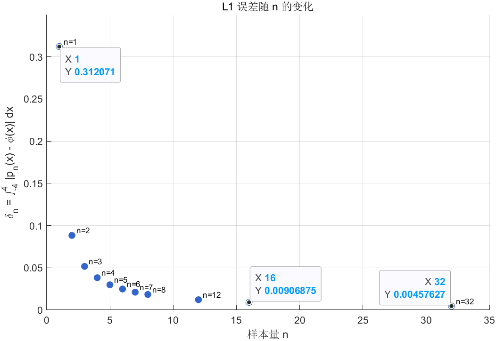

$p_n(x)$与标准正态分布概率密度函数的比较：

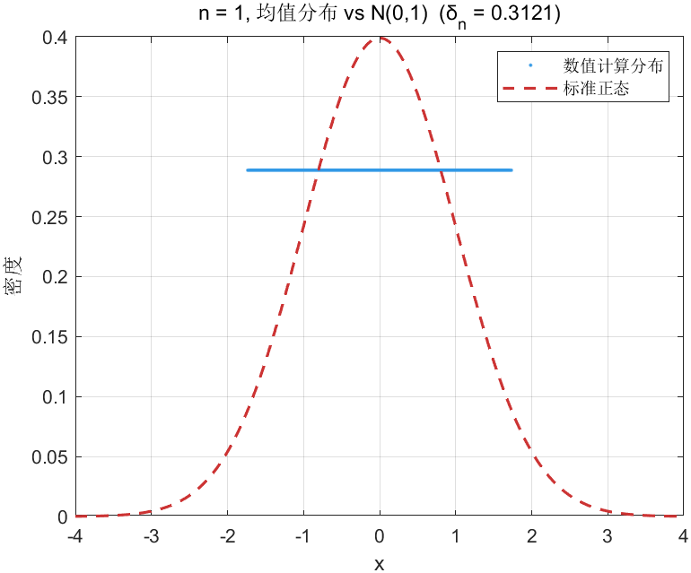

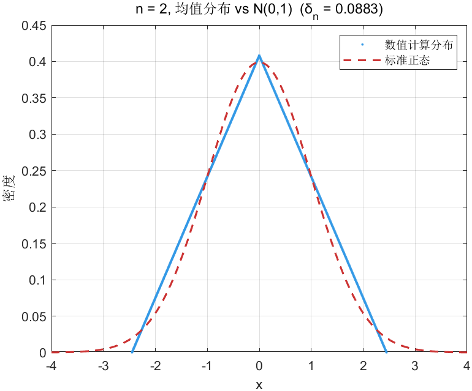

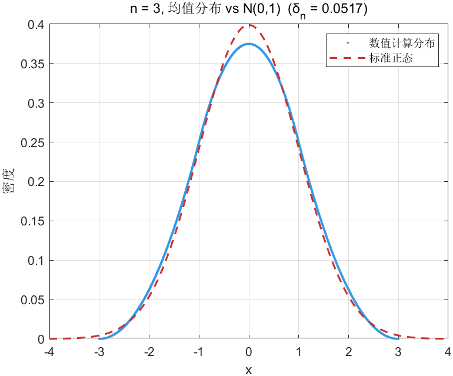

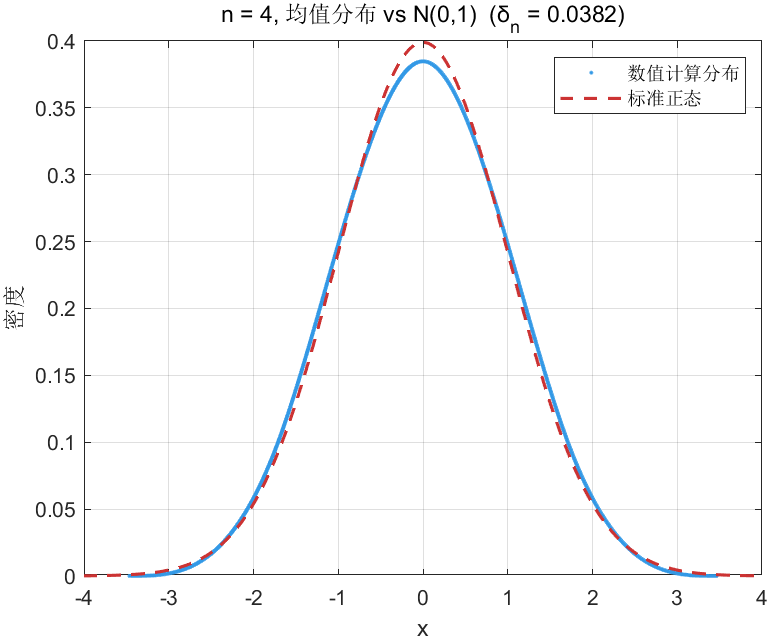

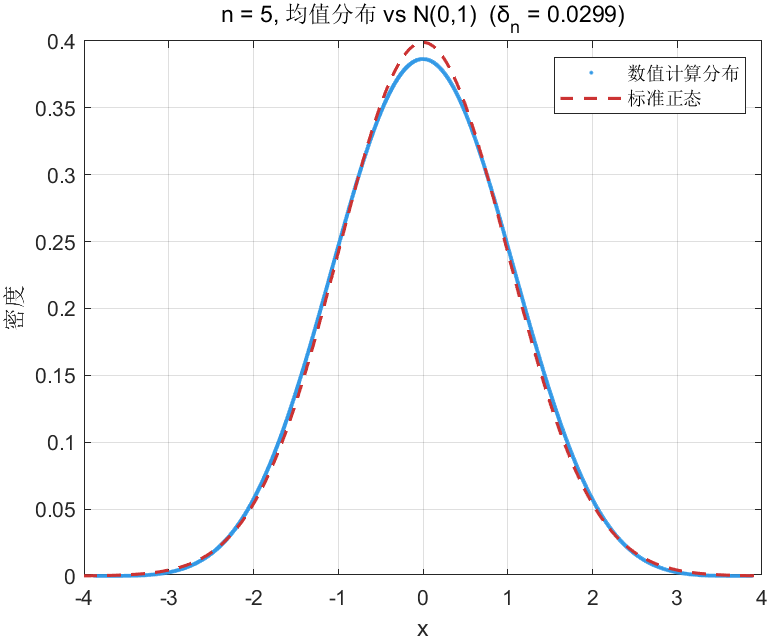

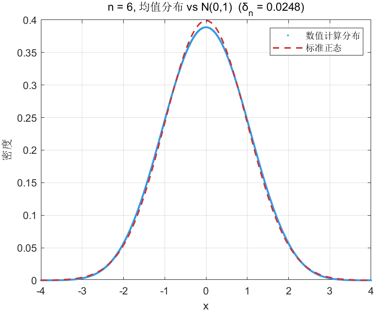

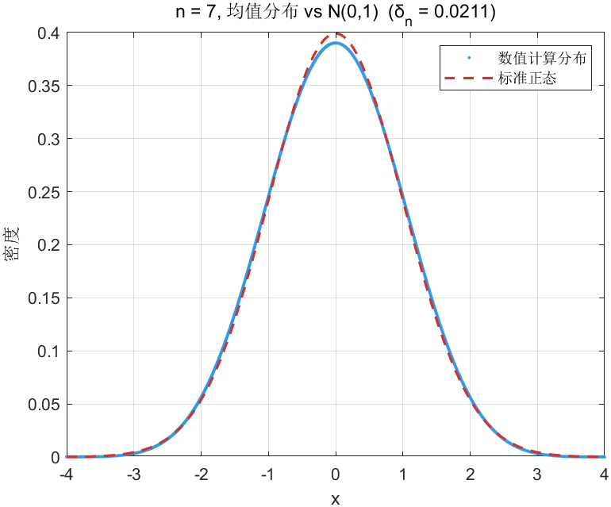

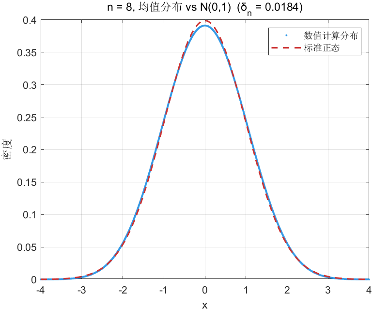

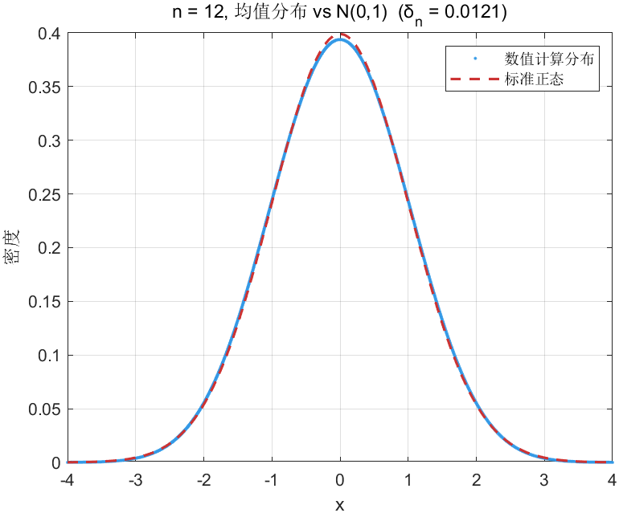

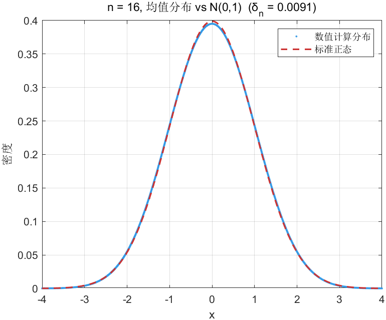

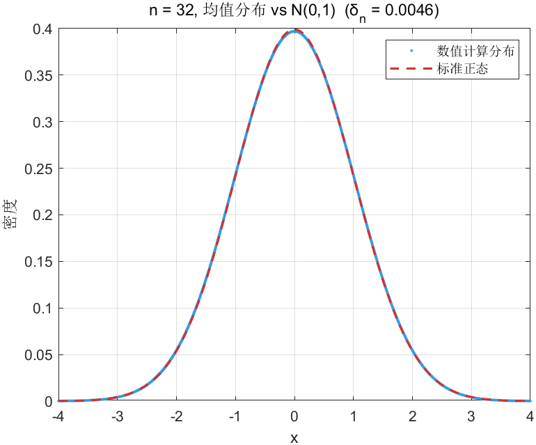

‍
