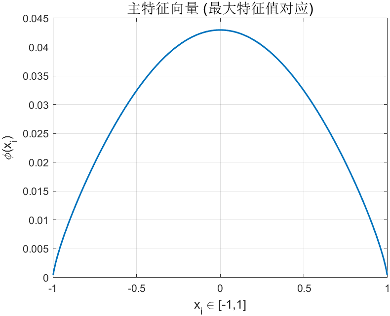

# Lévy过程首达概率的数值估计

### 计算特征值推导

取步长 $h = \frac{2}{n}$，不妨设 $n$ 为偶数。

令 $x_k = - 1 + hk$ ($k = 1, 2 \dots n - 1$)，$x_0 =-1, x_n = 1$，其中 $x_{\frac{n}{2}} = 0$。

令 $E = \mathbb{R} \backslash ( - h , h )$，这里暂时取 $C_\alpha = 1$。

则算子 $\mathcal{A}$ 作用于函数 $\phi(x)$ 的积分表达式为：

$$
\begin{aligned}
\mathcal{A} \phi(x) &= \int_{\mathbb{R}\setminus\{0\}} \left( \phi(x+z) - \phi(x) \right) \frac{dz}{|z|^{1+\alpha}} \\
&= \int_E \phi(x+z) \frac{dz}{|z|^{1+\alpha}} + \phi(x) \int_E \frac{dz}{|z|^{1+\alpha}} + \int_{(-h,h)\setminus\{0\}} \left( \phi(x+z) - \phi(x) \right) \frac{dz}{|z|^{1+\alpha}}
\end{aligned}
$$

将上述积分分为三部分 $I_1, I_2, I_3$，给定 $x = x_i$：

#### 1. 第一部分积分 $I_1$

对 $I_1$ 考虑区域 $- 1 < x_i + z < 1$，即 $x_i + z$ 遍历网格点 $x_{1} , x_{2} \cdots x_{i - 1} , x_{i + 1} \cdots x_{n - 1}$：

$$
I_{1} = \sum_{k = 1 , k \neq i}^{n - 1} \phi ( x_{k} ) \frac{h}{| x_{k} - x_{i} |^{1 + \alpha}}
$$

#### 2. 第二部分积分 $I_2$

对 $I_2$ 进行计算：$-\phi(x_i) \cdot 2\int_h^\infty \frac{dz}{z^{1+\alpha}}$  

$$
I_{2} = \phi ( x_{i} ) \left( \int_{-\infty}^{-h} \frac{d z}{| z |^{1 + \alpha}} + \int_{h}^{\infty} \frac{d z}{| z |^{1 + \alpha}} \right)
$$

$$
= \phi ( x_{i} ) \cdot 2 \int_{h}^{+\infty} \frac{d z}{z^{1 + \alpha}} = \frac{2}{\alpha} h^{-\alpha} \phi ( x_{i} )
$$

#### 3. 第三部分积分 $I_3$

对 $I_3$ 在 $(-h, h) \setminus \{0\}$ 中考虑泰勒展开：

$$
\phi(x_i + z) - \phi(x_i) = \phi'(x_i)z + \frac{1}{2}\phi''(x_i)z^2 + o(z^3)
$$

在积分中，第一项为奇函数积分为 0，则：

$$
I_{3} \approx \int_{0}^{h} \phi''(x_i) z^{2} \frac{d z}{z^{1 + \alpha}} = \phi''(x_i) \int_{0}^{h} z^{1 - \alpha} d z = \frac{1}{(2-\alpha)} \phi''(x_i) h^{2 - \alpha}
$$

而 $\phi''(x_i)$ 近似为二阶差分：

$$
\phi''(x_i) \approx \frac{1}{h^2} ( \phi ( x_{i + 1} ) - 2 \phi ( x_{i} ) + \phi ( x_{i - 1} ) )
$$

则：

$$
I_3 \approx \frac{1}{2 - \alpha} h^{-\alpha} ( \phi ( x_{i + 1} ) - 2 \phi ( x_{i} ) + \phi ( x_{i - 1} ) )
$$

#### 4. 综合结果

综上所述，离散化后的算子 $A$ 作用于 $\phi(x_i)$ 为：

$$
\mathcal{A} \phi ( x_{i} ) = \sum_{k = 1 , k \neq i}^{n - 1} \phi ( x_{k} ) \frac{h}{| x_{k} - x_{i} |^{1 + \alpha}} + \frac{2}{\alpha} h^{-\alpha} \phi ( x_{i} ) + \frac{1}{2 - \alpha} h^{-\alpha} ( \phi ( x_{i + 1} ) - 2 \phi ( x_{i} ) + \phi ( x_{i - 1} ) )
$$

选取$( \phi ( x_{1} ) , \phi ( x_{2} ) \cdots \phi ( x_{n - 1} ) )$的系数，有：

$$
M_{ij} = 
\begin{cases} 
\left( \frac{2}{\alpha} - \frac{2}{2-\alpha} \right) h^{-\alpha} & j = i \\ 
\left( \frac{1}{2-\alpha} + 1 \right) h^{-\alpha} & j = i+1 \text{ 或 } i-1 \\ 
\frac{h}{|x_j - x_i|^{1+\alpha}} & \text{其它 } j 
\end{cases}
$$

令 $M = ( M_{i i} )_{( n - 1 ) \times ( n - 1 )}$ 为系数矩阵，$v = ( \phi ( x_{1} ) , \phi ( x_{2} ) \cdots \phi ( x_{n - 1} ) )^{T}$ 为特征向量。

则特征值问题 $\mathcal{A} \phi ( x ) = \lambda \phi ( x)$ 转化为矩阵特征值问题：

$$
M v = \lambda v
$$

MATLAB对矩阵运算支持较好，用其中已经支持的函数求矩阵最大特征值及其对应特征向量 $v' = ( \phi' ( x_{1} ) \cdots \phi' ( x_{n-1} ) )$ 并绘制 $( x_{i} , \phi' ( x_{i} ) )$ 图像。

若有$C_\alpha$，则进行赋值$M \leftarrow C_\alpha M$即可

‍

### 代码实现

查阅资料，Lévy 过程的固有参数为

$$
\boldsymbol{C_\alpha = \frac{\alpha \cdot \Gamma(\alpha)}{\pi} \sin\left( \frac{\pi \alpha}{2} \right)}
$$

边界部分使用狄利克雷零边界$\phi(x_0)=\phi(x_n)=0$  

按上述方法，计算特征值，特征向量和概率下界的估计

$$
P\left( \sup_{0 < s \leq 1} |Z_s| < \varepsilon \right) > e^{-\lambda\varepsilon}
$$

计算结果发现特征值异常大，且数量级随步长$h$增大而增大，学习到数值计算时应对计算得来的特征值除一个$h^{-\alpha}$去量纲处理，根据上证指数数据估计得到$\alpha \approx 1.46$，带入这个值和$\varepsilon=0.1$得到：

```plaintext
========== 计算结果 ==========
n      = 1000
alpha  = 1.4600
eps    = 0.1000
h      = 2.00e-03
lambda_true = 1.260885
P > exp(-λ·ε) = 0.88153687
==============================
```



‍

#### *具体代码

```matlab
%% 对称α-稳定Lévy过程 首达概率下界（正确尺度归一化 + 绘图）
% 公式：P( sup_{0<s≤1} |Z_s| < ε ) > exp(-λ·ε)
% 正确尺度：λ_true = 离散特征值 / h^alpha
clear; clc; close all;

%% ===================== 可调参数 =====================
n       = 1000;        % 网格点数（偶数）
alpha   = 1.46;        % 稳定过程阶数 0<alpha<2
epsilon = 0.1;         % 阈值 ε
%% ====================================================

%% 1. 对称 α-稳定过程标准系数 C_α
C_alpha = (alpha * gamma(alpha)/pi) * sin(pi*alpha/2);

%% 2. 网格
h       = 2 / n;                  % 步长
x_full  = -1 : h : 1;             % 全网格（包含边界）
x_d     = x_full(2:end-1);        % 内部点（Dirichlet 边界）
m       = length(x_d);            % 内部点数

%% 3. 构造离散生成元矩阵 M
M = zeros(m, m);

% ------------------- 非局部项 I1 -------------------
% 对所有 j ≠ i，贡献为 h / |x_j - x_i|^(1+alpha)
for i = 1:m
    for j = 1:m
        if i ~= j
            M(i,j) = h / abs(x_d(j) - x_d(i))^(1+alpha);
        end
    end
end

% ------------------- 局部项 I2 + I3 -------------------
% I2 对角贡献：2/α * h^(-α)
% I3 对角贡献：-2/(2-α) * h^(-α)
% I3 邻点贡献：1/(2-α) * h^(-α)   （用于相邻点）
coef_I2      = 2/alpha * h^(-alpha);
coef_I3_diag = -2/(2-alpha) * h^(-alpha);
coef_I3_adj  = 1/(2-alpha) * h^(-alpha);

for i = 1:m
    % 对角元：已有的非局部项 + I2 + I3 对角
    M(i,i) = M(i,i) + coef_I2 + coef_I3_diag;
    % 邻点：已有的非局部项 + I3 邻点补充
    if i > 1
        M(i,i-1) = M(i,i-1) + coef_I3_adj;
    end
    if i < m
        M(i,i+1) = M(i,i+1) + coef_I3_adj;
    end
end

% 乘以常数 C_α
M = C_alpha * M;

%% 4. 特征值计算 + 正确尺度归一化
[V, D]   = eig(M);
eig_vals = diag(D);
[lambda_max_d, idx] = max(eig_vals);   % 最大特征值（离散尺度）
lambda_true = lambda_max_d * h^alpha;  % 去量纲后的真实特征值
phi      = V(:, idx);                  % 对应特征向量

% 确保特征向量符号一致（可选）
if phi(1) < 0
    phi = -phi;
end

%% 5. 概率下界
prob_lower = exp(-lambda_true * epsilon);

%% 6. 输出结果
fprintf('\n========== 计算结果 ==========\n');
fprintf('n      = %d\n', n);
fprintf('alpha  = %.4f\n', alpha);
fprintf('eps    = %.4f\n', epsilon);
fprintf('h      = %.2e\n', h);
fprintf('lambda_true = %.6f\n', lambda_true);
fprintf('P > exp(-λ·ε) = %.8f\n', prob_lower);
fprintf('==============================\n');

%% 7. 绘图：主特征向量
figure('Color','w');
plot(x_d, phi, 'LineWidth', 1.5);
grid on; box on;
xlabel('x_i \in [-1,1]', 'FontSize', 12);
ylabel('\phi(x_i)', 'FontSize', 12);
title('主特征向量 (最大特征值对应)', 'FontSize', 14);
```
